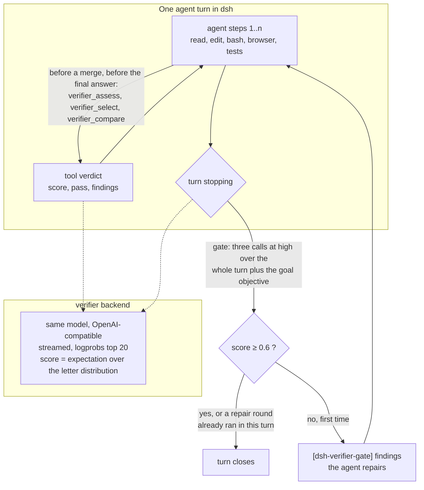
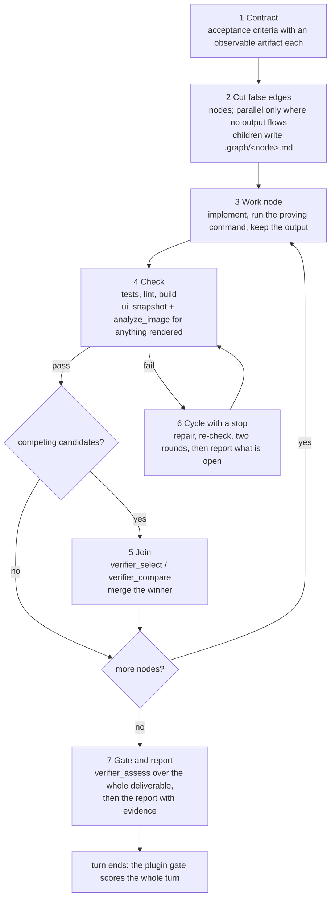

# dsh-verifier-gate

An LLM-as-a-verifier plugin for [DeepSeek Harness](https://github.com/deepseek-ai/deepseek-harness) (`dsh`). It adds one quality gate at the end of every agent turn, plus three tools the agent can call to check its own work.

The scoring method is a port of [llm-as-a-verifier](https://github.com/llm-as-a-verifier/llm-as-a-verifier) by Kwok et al. (project site [llm-as-a-verifier.com](https://llm-as-a-verifier.com/), paper arXiv 2607.05391, MIT). That repo selects the best of N agent trajectories. This plugin takes the same math and wires it into a running harness.

## How it fits together

Two pictures. The first is the plugin inside one agent turn: where it reads, where it speaks. The second is the skill `graph-verified-coding`, the working method that decides when the agent calls the tools.





## Why a verifier

The method comes from the llm-as-a-verifier authors. Their framework (source: [llm-as-a-verifier.com](https://llm-as-a-verifier.com/)): probability over the logits instead of a sampled token, a fine-grained scoring token, repetition, and decomposition into simpler criteria, aggregated as R(x, tau) = 1/(C K) sum over criteria, repeats and scale values of p(v | x, c, tau) phi(v).


What that buys with the same model this plugin runs on (chart from the llm-as-a-verifier README; Terminal-Bench 2.1, mini-swe-agent, DeepSeek V4 Flash as generator and verifier, costs at OpenRouter prices of 2026-08-17): best-of-3 lifts DeepSeek V4 Flash from 78.7% to 86.5%, best-of-5 to 88.0%, at roughly a quarter of the cost per task of GPT-5.6 Sol in Codex.


The gate in this plugin is the cheaper cousin of that best-of-N selection: one trajectory, scored once at the end, repaired once. `verifier_select` is the best-of-N itself.

## What it does

**The gate.** When an agent is about to end a turn, the plugin serializes the turn (the task, the assistant messages, every tool call and its observed output) and asks a verifier model to score it per criterion on a 20-letter scale. The score is not the sampled letter. It is the expectation over the logprob distribution of the score token, so the verdict is continuous in [0, 1]. If the mean falls below `gate.threshold`, the verifier's findings go back to the agent as a plugin message and the harness runs another step. The agent sees text like this:

```
[dsh-verifier-gate] Verification of your turn: 0.28 / 1.00, pass threshold 0.60, round 1 of 1.
Per criterion: Empirical Verification 0.13, Specification Adherence 0.21, Code Quality 0.50.

Empirical Verification (0.13):
The agent launched three background subagents ... There is zero observed verification in the trajectory: no npm test run, no curl of the service endpoints, no screenshot ...
```

That example is from a real run. The agent answered "Fair criticism, let me check what's actually on disk now instead of trusting narration" and went back to work. Continuations are capped per turn (`gate.maxRounds`, default 1). Turns that end with a question to the user are never forced on.

The gate is the whole of the automatic verification. There are no mid-turn readings and no reminders: the agent works, the verifier reads the finished turn once, at full effort, the way the reference scores a finished trajectory. Earlier versions of this plugin scored the running turn every forty steps at low effort and nudged the agent after twelve unverified edits; that cost more wall-clock than it found, and the findings that changed outcomes came from the full-effort gates. Inside a turn the agent calls the verifier itself, at the points the skill names.

**The tools.**

| Tool | What it does |
| --- | --- |
| `verifier_assess(task, answer)` | Scores one result per criterion and returns the findings. By default it also hands the verifier the observed trajectory of the current turn, so the verdict rests on tool output rather than on the agent's summary. |
| `verifier_select(task, candidates[])` | Best-of-N. Pairwise comparisons with slot swapping, then a probabilistic pivot tournament picks the winner in N + k(N-k) comparisons instead of N². |
| `verifier_compare(task, a, b)` | One directed pairwise reward. |
| `ui_snapshot(url)` | Evidence for visual work: headless screenshots of one URL across viewports (default 1440x900 and 390x844) in light and dark mode, written as PNGs under `$DSH_HOME/verifier/snapshots/<label>/`, plus the console errors, page errors and failed requests seen while loading. Runs Playwright against the installed Google Chrome (then Playwright's Chromium); nothing opens on screen. Pair it with a vision tool such as `analyze_image` for the verdict. |

**The backend.** Any OpenAI-compatible chat-completions endpoint that returns `logprobs` and `top_logprobs` (vLLM, SGLang, the DeepSeek API). The logprobs are what make the fine-grained score; an endpoint without them is not supported, the same requirement the reference states.

## Prompts

The verifier-facing text is the reference's. The pairwise prompt (`build_prompt`), the two scale descriptions and the ground-truth notes are verbatim. The `coding` criteria are `specification` from `criteria/terminal_bench.md` plus `code_review` and `verification` from `criteria/swe_bench.md` ("issue" read as "task", and the patch defined as diff output or the file contents written through tools, because a harness trajectory carries edits as tool calls); `terminal` is `criteria/terminal_bench.md`; `general` is this plugin's own set for prose and answers. The single-trajectory assessment prompt behind the gate and `verifier_assess` is the reference progress prompt (`build_progress_prompt`) reduced to the final state and extended with one criterion guideline and a request to name what is missing, because that analysis is what the agent gets back. The agent-facing texts (tool descriptions, the gate message) are this plugin's own.

## What is ported, and where

| Reference concept | File |
| --- | --- |
| 20-letter scale, pairwise orientation (A = best) and progress orientation (T = best) | `src/core/scale.ts` |
| Reward as logprob expectation, last-tag match, fused `>A` tokens, whitespace skip, literal-letter fallback | `src/core/scoring.ts` |
| Criteria × repeats with slot swap on odd repeats; `compare`, `select`, `assess` | `src/core/verifier.ts` |
| Pivot tournament: ring pass, top-k pivots, pivot round, Bradley-Terry argmax | `src/core/tournament.ts` |
| Prompts with the invariant part first and the criterion last (prefix-cache friendly); criteria sets `general`, `coding`, `terminal` | `src/core/prompts.ts` |
| Trajectory serialization from the harness session log | `src/trajectory.ts` |

Things the reference repo does not have: the turn gate (`src/gate.ts`), the tools (`src/tools.ts`), hot-reloadable settings, and the handling of unscored verdicts described below.

## Install

```sh
git clone https://github.com/DevRico003/dsh-verifier-gate
dsh plugin --profile web add /path/to/dsh-verifier-gate
dsh plugin --profile headless add /path/to/dsh-verifier-gate
dsh plugin --profile desktop add /path/to/dsh-verifier-gate    # DSH Desktop
```

`lib/` is committed, so no build step is needed to install. Restart `dsh web` or the desktop app afterwards.

## Configure

Defaults live in `cordis.patch.yml`. The shipped `backend.baseURL` is the placeholder `http://YOUR_SPARK_HOST:8000/v1`; until you set a real endpoint the plugin loads but every verifier call fails with a message naming this setting (the gate then closes turns unverified and logs a warning, `verifier_assess` returns `scoredCriteria: 0` with the message in `findings`). Set at least `backend.baseURL` and `backend.model`. Everything is a hot-reloadable `verifier:` section in `$DSH_HOME/settings.yaml`; no restart.

```yaml
verifier:
  backend:
    baseURL: http://YOUR_SPARK_HOST:8000/v1
    model: deepseek-v4-flash-0731
    apiKeyEnv: SPARK_API_KEY       # env var or credential reference; empty = no Authorization header
    reasoningEffort: high          # every verifier call, gate and tools; low is ~3x faster, none is a one-shot reading
    maxTokens: 65536               # reasoning shares the budget; room so a long think still ends in an answer
    temperature: 1.0               # the reference default; keeps the logprob distribution informative
    topLogprobs: 20
    concurrency: 8                 # an assessment is 3 calls, a select over three candidates 15; they fan out together
    retriesOnFallback: 1
    warmPrefix: false              # true = first call per prompt prefix alone, then the rest (saves prefill, doubles wall-clock)
    timeoutMs: 3600000             # last-resort cap per call
    idleTimeoutMs: 900000          # abort when the stream delivers nothing for this long (a queued request is silent until scheduled)
  gate:
    enabled: true
    threshold: 0.6
    maxRounds: 1
    evaluations: 1                 # repeats per criterion, gate and verifier_assess alike
    criteria: auto                 # coding when the turn used tools, else general; or general | coding | terminal
    skipWhenAskingUser: true
    skipSubagents: true            # child agents are not gated; their parent turn is
    minToolCallsWithoutOwnTask: 8  # a turn opened only by a subagent report or notice is gated only with real work in it
    feedbackMaxChars: 2500
    timeoutMs: 4200000
  select:
    evaluations: 1                 # for verifier_select and verifier_compare; 2 swaps A/B and cancels slot bias at twice the calls
    pivots: 1
    seed: 0
    criteria: general
  trajectory:
    maxStepChars: 6000             # per tool output / message excerpt
    maxTotalChars: 300000          # whole turn; over the cap the middle is elided, the opening and the most recent steps stay
    continuationTurns: 1           # a turn opening with "Continue." gets this many earlier turns prepended
  snapshot:
    enabled: true                  # the ui_snapshot tool
    channels: [chrome, chromium]   # tried in order; chrome = installed Google Chrome
    headless: true
    viewports: ["1440x900", "390x844"]
    settleMs: 500
    navigationTimeoutMs: 30000
    dir: ""                        # empty = $DSH_HOME/verifier/snapshots
  tools: true
  verbose: false                   # true logs every verifier call with duration, token counts and score source
```

`gate.enabled: false` keeps the tools and drops the gate. `enabled: false` turns the plugin off.

## Which turns are gated

Every turn with a task and work in it, once, when it stops. Three cases are handled so the gate judges the right thing:

- A turn that opens with "Continue." (auto-continue after an interruption, a resumed goal round) holds little of the work, so the trajectory handed to the verifier prepends the previous turn (`trajectory.continuationTurns`); otherwise a gate right after a restart would see commands but no code.
- A goal that runs over several turns carries its objective only in the first; later turns are judged against that objective, not against "Continue.".
- Some hosts open a new turn for every subagent report. Such a turn usually holds an acknowledgement and nothing else, and judging it against the goal would fail it for everything the goal still lacks, so a turn without its own task message is gated only when it made at least `gate.minToolCallsWithoutOwnTask` tool calls.

Child agents (subagents, team members) are not gated; the parent's turn is.

## Cost

One gate pass is `criteria × evaluations` verifier calls, three by default, fanned out together. `warmPrefix: true` runs the first call alone so the server caches the prompt prefix (task, trajectory, scale; the criterion sits at the tail) before the rest go out; that is the reference's 3.4× saving in uncached input tokens, worth it on a priced API or a slow prefill. On a local vLLM that prefills at over 10k tokens per second it only doubles the wall-clock of every gate, so it ships off.

The verifier thinks at `high`, the reference's setting for its DeepSeek-V4-Flash numbers, and it gets room: `maxTokens` 65536, no thinking budget, calls stream. Measured on a DGX Spark pair serving DeepSeek-V4-Flash: the end-of-turn gate over a long turn (a 98k-token prompt) took 263 to 401 s; a `verifier_assess` over a 27k-token trajectory 284 to 470 s; a `verifier_select` over three candidates with two repeats 22 minutes on four slots, so one repeat on eight slots is the default. The calls are short prompts and long answers, so they are generation-bound and share the GPUs: more concurrent calls mean slower calls, not more throughput. Every call is a streamed response, so no header timeout fires while the model thinks; an idle timer (`idleTimeoutMs`) aborts a stream that goes silent, and `timeoutMs` is a last-resort cap of an hour. If you want speed over the reference setting, `reasoningEffort: low` gave verdicts within 0.06 of `high` on an A/B here at about a third of the time; `none` is a one-shot reading for chat sessions.

With thinking on, vLLM returns the reasoning tokens inside `logprobs.content` as well; the score reader walks the token stream and takes the letter after the last `<score>` tag, so that is handled. A reply that spends the whole budget on reasoning carries no answer and is reported as a failed call (retried once, then unscored), never as a 0.5.

When a turn outgrows the trajectory cap, the opening steps stay and the middle is elided, so every gate of one turn sends the same prefix and a prefix-caching server (vLLM) prefills only the tail.

## Unscored verdicts

A verifier reply sometimes carries no parseable score tag. The plugin retries such a call (`backend.retriesOnFallback`, default 1). What still has no verdict is excluded from every mean and reported as `scored: false`, never counted as a neutral 0.5. A gate pass with zero scored criteria closes the turn unverified and logs it instead of steering the agent on noise.

## Skill

`skills/graph-verified-coding/SKILL.md` is a dsh skill (also usable by Claude Code or Codex from `~/.agents/skills`) that tells the agent how to use the verifier inside a graph-engineered coding process. Seven steps, each with a done-condition: contract, cut false edges, work node, check (deterministic checks and the browser loop per node), join (`verifier_select` over competing candidates), cycle with a stop, gate and report (`verifier_assess` over the whole deliverable, then the report with evidence). The verifier calls sit where they pay, before a merge and before the final answer, because each one thinks at full effort for minutes. Link it into a skill root dsh scans:

```sh
ln -s /path/to/dsh-verifier-gate/skills/graph-verified-coding ~/.dsh/skills/graph-verified-coding
```

## Day to day

Nothing to start. The gate runs on its own at the end of every turn: a passing turn closes without a trace in the chat (the log says `PASSED`), a failing one gets the `[dsh-verifier-gate]` message and one repair round. Expect the agent to look busy for one to seven minutes after its last visible step; that is the gate thinking.

The tools are registered in every session; whether the agent calls them is decided by the skill. Point your session at it once (`~/.dsh/AGENTS.md` or the equivalent: "for coding work that spans more than one file or step, has competing approaches, or runs unattended, load the skill `graph-verified-coding` first"), and the agent loads it for such work. To be sure on a given task, name it in the prompt ("load graph-verified-coding, then build ...") or use one of its trigger words: verify, gate, best-of. You can also ask for a tool directly: "make two variants and pick one with verifier_select", "assess the result with verifier_assess against the contract".

For short chat sessions set `verifier: backend: reasoningEffort: low` or `none` in `settings.yaml` (hot-reloaded); `verifier: gate: enabled: false` keeps the tools and drops the gate. With `verbose: true` the host log (`dsh web` terminal, or `~/Library/Application Support/DSH Desktop/logs/dsh-<date>.log` for DSH Desktop) shows every verifier call with its duration and the gate verdict per turn.

## Development

Typechecking needs a DeepSeek Harness checkout next to this repo (the `link:` devDependencies point at `../deepseek-harness`). The published `@deepseek-ai/dsh-*` packages on npm are an older generation and do not typecheck against the current harness.

```sh
pnpm install
pnpm run build      # tsc -> lib/
pnpm test           # node:test unit tests
```

## Limitations

- The endpoint must return logprobs. There is no text-only fallback route.
- Score caching exists only inside one `select` call. There is no on-disk cache across calls.
- Criteria sets are built in. Custom criteria files are not loaded yet.
- No custom session events are appended, so session logs stay readable by processes without this plugin. Outcomes are visible through the steered message and the harness logger.

## License

MIT. The scoring method and prompt texts are ported from [llm-as-a-verifier](https://github.com/llm-as-a-verifier/llm-as-a-verifier) ([llm-as-a-verifier.com](https://llm-as-a-verifier.com/), MIT); see `LICENSE`. Thank you to the authors for publishing the method, the prompts and the benchmarks.
